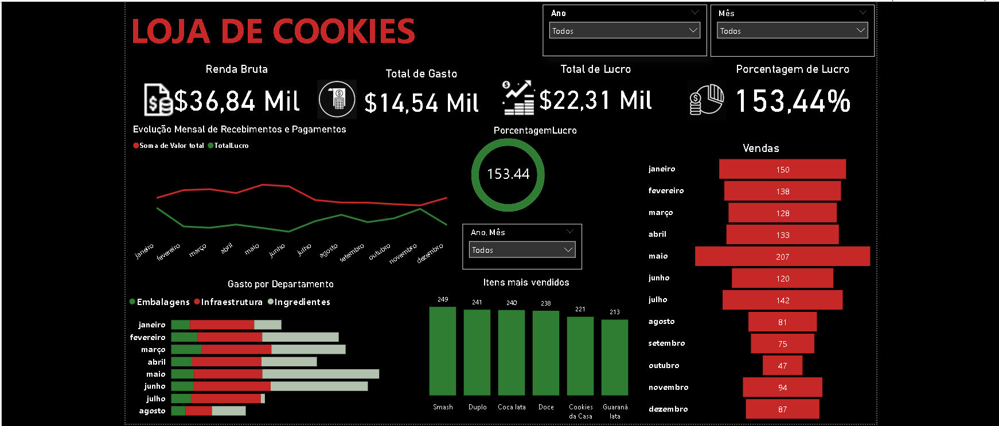

# 📊 Automação Financeira e Comercial para Pequenos Negócios

Projeto desenvolvido como Trabalho de Conclusão de Curso (TCC) em Sistemas de Informação, com o objetivo de criar uma solução integrada para gestão de vendas e controle financeiro de pequenos negócios.

---

## 📌 Contexto

Pequenos empreendedores frequentemente enfrentam dificuldades no controle de pedidos, estoque e finanças, utilizando processos manuais que geram erros, retrabalho e falta de visibilidade dos dados.

Este projeto propõe uma solução digital para centralizar essas informações e apoiar a tomada de decisão por meio da organização e análise de dados.

---

## 🎯 Objetivo

Desenvolver um sistema capaz de:

* Centralizar pedidos e vendas
* Auxiliar no controle financeiro
* Organizar dados para análise
* Permitir evolução para dashboards e Business Intelligence (BI)

---

## 📷 Visualização do Dashboard

---

## 👩‍💻 Minha participação

Atuei diretamente nas seguintes atividades:

* Criação de dados simulados para testes e validação
* Desenvolvimento de dashboards no Power BI
* Estruturação e organização de dados para análise
* Apoio na modelagem do banco de dados
* Contribuição na elaboração do artigo acadêmico

---

## 🛠 Tecnologias utilizadas

### 💻 Desenvolvimento

* HTML
* CSS
* JavaScript
* Node.js
* Express

### 🗄️ Banco de Dados

* PostgreSQL

### 📊 Dados & BI

* Power BI

---

## 📈 Principais análises (Dashboard)

* Renda bruta, gastos e lucro
* Percentual de lucratividade
* Evolução mensal de receitas e despesas
* Análise de vendas por período
* Identificação dos itens mais vendidos
* Distribuição de gastos por categoria

---
## 📊 Insights do Dashboard

A análise dos dados permitiu identificar padrões relevantes no desempenho financeiro e operacional:

- O negócio apresenta alta lucratividade, com margem superior a 150%, indicando forte controle sobre os custos em relação à receita.

- Observa-se variação nas vendas ao longo dos meses, com picos em determinados períodos, sugerindo possível sazonalidade no consumo.

- Alguns produtos se destacam consistentemente entre os mais vendidos, indicando oportunidades para estratégias focadas em itens de maior demanda.

- A distribuição de gastos evidencia maior concentração em categorias específicas, o que pode indicar pontos de otimização de custos.

- A comparação entre receitas e despesas ao longo do tempo permite identificar períodos de maior eficiência financeira e possíveis momentos de atenção.

Esses insights demonstram como a análise de dados pode apoiar decisões estratégicas e melhorar a gestão do negócio.

---

## 📊 Resultados

* Estruturação de base de dados organizada
* Desenvolvimento de dashboards para análise financeira
* Simulação de dados para testes do sistema
* Melhoria na visualização e interpretação dos dados

---

## 💡 Possíveis aplicações

* Apoio à tomada de decisão em pequenos negócios
* Controle financeiro mais eficiente
* Identificação de oportunidades de melhoria no negócio

---

## 👥 Projeto em grupo

* Kelly Oliveira
* Matheus (repositório original: https://github.com/Matheushsp/Tcc-main)

### 🎓 Orientação

* Prof. Leandro Grando (Orientador)
  https://lgrando1.github.io/

---

## 📌 Observação

Este projeto possui fins acadêmicos e demonstra habilidades em desenvolvimento de sistemas, análise de dados e construção de soluções voltadas a negócio.

---

✨ *Projeto que integra desenvolvimento de sistemas com análise de dados para geração de insights estratégicos.*

